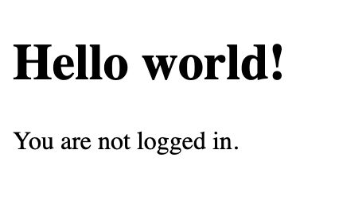
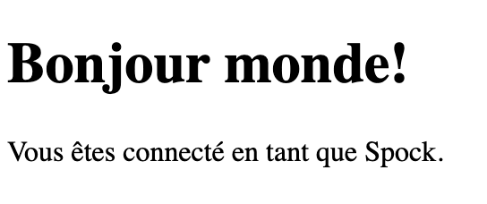
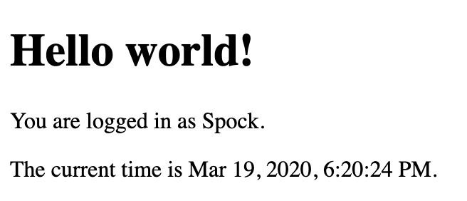

## Internationalization (i18n)
The project focuses on learning how to do internationalization of web pages using the Babel Flask extension.

**0. Basic Flask app**

[0-app.py](./0-app.py) is a simple Python script that sets up basic Flask application which adheres to the following requirements:
- Create a single / route and an [0-index.html](/templates/0-index.html) template that simply outputs “Welcome to Holberton” as page title `(<title>)` and “Hello world” as header `(<h1>)`

**1. Basic Babel setup**
- Copy [0-app.py](./0-app.py) into [1-app.py](/1-app.py) and [templates/0-index.html](/templates/0-index.html) into [templates/1-index.html](/templates/1-index.html).
- Install the Babel Flask extension
```
pip3 install flask_babel
```
- Then instantiate the `Babel` object in your app. Store it in a module-level variable named `babel`.
- In order to configure available languages in our app, you will create a `Config` class that has a `LANGUAGES` class attribute equal to `["en", "fr"]`.
- Use `Config` to set Babel’s default locale (`"en"`) and timezone (`"UTC"`).
- Use that class as config for your Flask app.

**2. Get locale from request**
- Copy [1-app.py](./1-app.py) into [2-app.py](/2-app.py) and [templates/1-index.html](/templates/1-index.html) into [templates/2-index.html](/templates/2-index.html).
- In [2-app.py](/2-app.py) create a `get_locale` function with the `babel.localeselector` decorator. Use `request.accept_languages` to determine the best match with our supported languages.

**3. Parametrize templates**
- Copy [2-app.py](./2-app.py) into [3-app.py](/3-app.py) and [templates/2-index.html](/templates/2-index.html) into [templates/3-index.html](/templates/3-index.html).
- Use the `_` or `gettext` function to parametrize your templates. Use the message IDs `home_title` and `home_header`.
- Create a `babel.cfg` file containing
```
[python: **.py]
[jinja2: **/templates/**.html]
extensions=jinja2.ext.autoescape,jinja2.ext.with_
```
- Then initialize your translations with
```
$ pybabel extract -F babel.cfg -o messages.pot .
```
and your two dictionaries with
```
$ pybabel init -i messages.pot -d translations -l en
$ pybabel init -i messages.pot -d translations -l fr
```
- Then edit files `translations/[en|fr]/LC_MESSAGES/messages.po` to provide the correct value for each message ID for each language. Use the following translations:

|msgid       |English                   |French                      |
|------------|--------------------------|----------------------------|
|home_title  |"Welcome to Holberton"    |"Bienvenue chez Holberton"  |
|home_header |"Hello world!"            |"Bonjour monde!"            |

- Then compile your dictionaries with

```
$ pybabel compile -d translations
```
- Reload the home page of your app and make sure that the correct messages show up.


**4. Force locale with URL parameter**
- In this task, you will implement a way to force a particular locale by passing the locale=fr parameter to your app’s URLs.
- Copy [3-app.py](./3-app.py) into [4-app.py](/4-app.py) and [templates/3-index.html](/templates/3-index.html) into [templates/4-index.html](/templates/4-index.html).
- In your get_locale function, detect if the incoming request contains locale argument and ifs value is a supported locale, return it. If not or if the parameter is not present, resort to the previous default behavior.
- Now you should be able to test different translations by visiting http://127.0.0.1:5000?locale=[fr|en].
- Visiting http://127.0.0.1:5000/?locale=fr should display this level 1 heading:

    


**5. Mock logging in**
- Copy [4-app.py](./4-app.py) into [5-app.py](/5-app.py) and [templates/4-index.html](/templates/4-index.html) into [templates/5-index.html](/templates/5-index.html).
- Creating a user login system is outside the scope of this project. To emulate a similar behavior, copy the following user table in `5-app.py`.
```
users = {
    1: {"name": "Balou", "locale": "fr", "timezone": "Europe/Paris"},
    2: {"name": "Beyonce", "locale": "en", "timezone": "US/Central"},
    3: {"name": "Spock", "locale": "kg", "timezone": "Vulcan"},
    4: {"name": "Teletubby", "locale": None, "timezone": "Europe/London"},
}
```
- Define a `get_user` function that returns a user dictionary or None if the ID cannot be found or if `login_as` was not passed.

- Define a `before_request` function and use the `app.before_request decorator` to make it be executed before all other functions. `before_request` should use `get_user` to find a user if any, and set it as a global on `flask.g.user`.

- In your HTML template, if a user is logged in, in a paragraph tag, display a welcome message otherwise display a default message as shown in the table below.

|msgid        |English                             |French                                        |
|-------------|------------------------------------|----------------------------------------------|
|logged_in_as |"You are logged in as %(username)s."|"Vous êtes connecté en tant que %(username)s."|
|not_logged_in|"You are not logged in."            |"Vous n'êtes pas connecté."                   |

- Visiting `http://127.0.0.1:5000/` in your browser should display this:

    

- Visiting `http://127.0.0.1:5000/?login_as=2` in your browser should display the following:

    

**6. Use user locale**
- Copy [5-app.py](./5-app.py) into [6-app.py](/6-app.py) and [templates/5-index.html](/templates/5-index.html) into [templates/6-index.html](/templates/6-index.html).
- Change your get_locale function to use a user’s preferred local if it is supported.

- The order of priority should be

    1. Locale from URL parameters
    2. Locale from user settings
    3. Locale from request header
    4. Default locale

Test by logging in as different users




**7. Infer appropriate time zone**
- Copy [6-app.py](./6-app.py) into [7-app.py](/7-app.py) and [templates/6-index.html](/templates/6-index.html) into [templates/7-index.html](/templates/7-index.html).
- Define a `get_timezone` function and use the `babel.timezoneselector decorator`.

- The logic should be the same as `get_locale`:

    1. Find timezone parameter in URL parameters
    2. Find time zone from user settings
    3. Default to UTC

- Before returning a URL-provided or user time zone, you must validate that it is a valid time zone. To that, use pytz.timezone and catch the pytz.exceptions.UnknownTimeZoneError exception.


**8. Display the current time**
- Copy [7-app.py](./7-app.py) into [app.py](/app.py) and [templates/7-index.html](/templates/7-index.html) into [templates/index.html](/templates/index.html).
- Based on the inferred time zone, display the current time on the home page in the default format. For example:

`Jan 21, 2020, 5:55:39 AM` or `21 janv. 2020 à 05:56:28`

- Use the following translations

|msgid        |English                                   |French                                        |
|-------------|------------------------------------------|----------------------------------------------|
|current_time_is |"The current time is %(current_time)s."|"Nous sommes le %(current_time)s."            |


**Displaying the time in French looks like this:**


**Displaying the time in English looks like this:**

